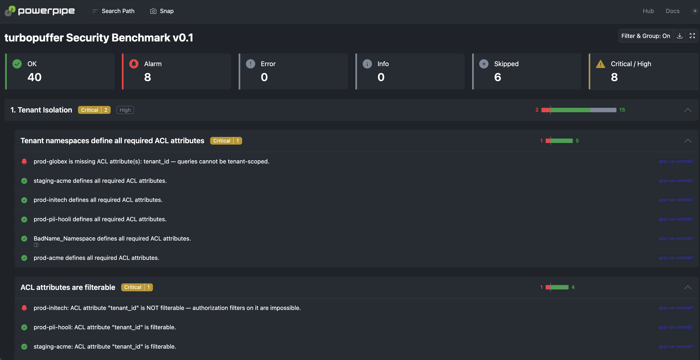

<picture>
  <source media="(prefers-color-scheme: dark)" srcset="docs/images/turbopuffer-lockup-dark.svg">
  
</picture>

# turbopuffer Security Benchmark Mod for Powerpipe

Run individual tenant-isolation, data-residency, encryption, schema-hygiene and operations controls — or the full security benchmark — across your [turbopuffer](https://turbopuffer.com) namespaces using [Powerpipe](https://powerpipe.io) and [Steampipe](https://steampipe.io).

> Unofficial community project. Not affiliated with or endorsed by turbopuffer inc. All read-only.

Run checks in a dashboard:



## Why

turbopuffer's own permissions documentation is explicit: row/document-level access control is the **application's** responsibility, implemented via attribute filters. There is no built-in RBAC below the API-key level. That's a reasonable architectural choice — and it means every turbopuffer customer is one missing schema attribute or one non-filterable field away from cross-tenant retrieval. Nothing audits that today. This does.

## What gets checked

| # | Control | Severity | Signal |
|---|---------|----------|--------|
| 1 | `tenant_isolation_acl_attributes_present` | critical | Tenant namespaces define the ACL attributes your filters depend on |
| 2 | `tenant_isolation_acl_attributes_filterable` | critical | …and those attributes are actually `filterable` (BM25 fields aren't, by default) |
| 3 | `tenant_isolation_namespace_naming` | medium | Namespaces match the naming convention other controls key off |
| 4 | `tenant_isolation_canary_document_present` | high | Honeytoken doc seeded per namespace (alert on its retrieval in your app logs) |
| 5 | `residency_approved_regions_only` | high | Namespaces only in approved regions |
| 6 | `residency_eu_namespaces_in_eu_regions` | critical | EU-tagged namespaces hosted in EU regions |
| 7 | `encryption_cmek_on_sensitive_namespaces` | high | Prod/PII namespaces use customer-managed keys |
| 8 | `encryption_cmek_keys_approved` | medium | CMEK keys come from the approved key inventory |
| 9 | `hygiene_sensitive_attribute_names` | high | No `ssn`/`card_number`/`api_key`-style attributes next to your vectors |
| 10 | `hygiene_sensitive_attributes_not_search_indexed` | high | Sensitive attrs aren't FTS/regex/glob/fuzzy-indexed (exposure amplification) |
| 11 | `hygiene_schema_drift_across_environments` | medium | `prod-x` and `staging-x` schemas match |
| 12 | `hygiene_empty_namespaces` | low | No abandoned empty namespaces |
| 13 | `ops_stale_namespaces` | medium | Every namespace has an owner writing to it (`updated_at` recency) |
| 14 | `ops_index_lag` | medium | No unindexed WAL bytes — recent writes are searchable, not silently missed |
| 15 | `ops_oversized_namespaces` | medium | Single-namespace blast radius under threshold |
| 16 | `ops_namespace_sprawl` | low | Total namespace count within budget |

Everything is tunable in `variables.pp`.

## Getting Started

### Installation

Install [Powerpipe](https://powerpipe.io/downloads), or use Brew:

```bash
brew install turbot/tap/powerpipe
```

This mod requires [Steampipe](https://steampipe.io) with the [turbopuffer plugin](https://github.com/somoore/steampipe-plugin-turbopuffer) as the data source. Install Steampipe (https://steampipe.io/downloads), or use Brew, then install the plugin:

```bash
brew install turbot/tap/steampipe
steampipe plugin install somoore/turbopuffer
```

Configure your connection with a turbopuffer API key and the regions to scan (see the [plugin docs](https://github.com/somoore/steampipe-plugin-turbopuffer)):

```bash
cp config/turbopuffer.spc ~/.steampipe/config/turbopuffer.spc
$EDITOR ~/.steampipe/config/turbopuffer.spc   # api_key + regions
```

Finally, install the mod:

```bash
mkdir dashboards
cd dashboards
powerpipe mod init
powerpipe mod install github.com/somoore/powerpipe-turbopuffer-security-benchmark
```

### Browsing Dashboards

Start Steampipe as the data source:

```bash
steampipe service start
```

Start the dashboard server:

```bash
powerpipe server
```

Browse and view your dashboards at **http://localhost:9033**.

Two branded dashboards ship with the mod:

- **turbopuffer: Security Posture** — box-drawn hero and Step 1/2/3 panels echoing the onboarding page, posture cards that flip coral on alert, and a Largest Namespaces table that drills into…
- **turbopuffer: Namespace Detail** — a namespace selector, size/freshness/encryption cards, a **Tenant Isolation: ready / NOT enforceable** verdict card (required ACL attributes present *and* filterable), and the full attribute schema with search-amplification flags.

### Running Checks in Your Terminal

Instead of running benchmarks in a dashboard, you can run them in your terminal with the `powerpipe benchmark` command:

List available benchmarks:

```bash
powerpipe benchmark list
```

Run the benchmark:

```bash
powerpipe benchmark run turbopuffer_security \
  --var 'required_acl_attributes=["tenant_id"]' \
  --var 'approved_regions=["gcp-us-central1"]'
```

Different output formats are also available — for more information see [Output Formats](https://powerpipe.io/docs/reference/cli/benchmark#output-formats).

## The data source

This mod queries the tables exposed by the [turbopuffer Steampipe plugin](https://github.com/somoore/steampipe-plugin-turbopuffer):

| Table | One row per | Notable columns |
|-------|-------------|-----------------|
| `turbopuffer_namespace` | namespace × region | `approx_row_count`, `approx_logical_bytes`, `created_at`, `updated_at`, `encryption_mode`, `encryption_key_name`, `index_status`, `schema` |
| `turbopuffer_namespace_attribute` | schema attribute | `type`, `filterable`, `full_text_search`, `regex`, `glob`, `fuzzy`, `vector_index`, `sparse_vector_index` |
| `turbopuffer_document` | document (requires `namespace` qual) | `id`, `attributes` — vectors always excluded; built for canary lookups, not export |
| `turbopuffer_namespace_recall` | recall evaluation (requires `namespace` qual) | `avg_recall`, `avg_ann_count`, `avg_exhaustive_count` — index-integrity signal |
| `turbopuffer_region` | configured region | `region`, `endpoint` — join anchor for residency queries |

Because it's all SQL in Steampipe, these join against the other 150+ plugins: put turbopuffer residency next to `aws_s3_bucket` residency in one report, or join namespaces against a `tenants.csv` to catch orphaned tenants.

## Grounding & honesty notes

- Endpoint paths and response fields were **verified against the official `turbopuffer-go/v2` client and the [turbopuffer OpenAPI spec](https://github.com/turbopuffer/turbopuffer-openapi)**, then confirmed against a live account. The metadata response is what makes CMEK, staleness, and index-lag controls real rather than aspirational.
- **Compiled, tested, and run against a live account** (0 errors against seeded live data, load-tested to 1,200+ namespaces).
- **The control-plane gap**: turbopuffer's public API is data-plane only. API keys, permissions, org membership and billing are dashboard-only — that's why there's no `turbopuffer_api_key` table. Track what you can't check; that list is the roadmap.

## Open Source & Contributing

This repository is published under the [Apache 2.0 license](https://www.apache.org/licenses/LICENSE-2.0). [Steampipe](https://steampipe.io) and [Powerpipe](https://powerpipe.io) are products produced by [Turbot HQ, Inc](https://turbot.com); this mod is an independent community project and is not affiliated with Turbot or turbopuffer inc.

turbopuffer logos are used under turbopuffer's [brand guidelines](https://turbopuffer.com/press).

## Get Involved

**[Join #powerpipe on Slack →](https://turbot.com/community/join)**
